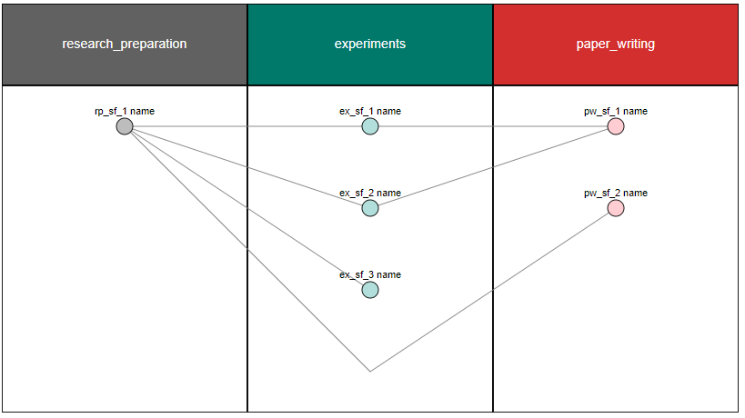

# Research Flow Activity

## Usage

### Drawing Research Flow Activity from json file

* Step 1. : Prepare a JSON file with Research Flow Activity

    Create `sample_research_flow_activity.json`

    ```json
    {
        "research_flow_pahse_data": [
            {
                "seq_number": 1,
                "name": "research_preparation",
                "sub_flow_data": [
                    {
                        "id": "rp_sf_1",
                        "name": "rp_sf_1 name",
                        "link": "rp_sf_1 link",
                        "parent_ids": [],
                        "create_datetime": 1
                    }
                ]
            },
            {
                "seq_number": 3,
                "name": "paper_writing",
                "sub_flow_data": [
                    {
                        "id": "pw_sf_1",
                        "name": "pw_sf_1 name",
                        "link": "pw_sf_1 link",
                        "parent_ids": [
                            "ex_sf_1",
                            "ex_sf_2"
                        ],
                        "create_datetime": 100
                    },
                    {
                        "id": "pw_sf_2",
                        "name": "pw_sf_2 name",
                        "link": "pw_sf_2 link",
                        "parent_ids": [
                            "rp_sf_1"
                        ],
                        "create_datetime": 100
                    }
                ]
            },
            {
                "seq_number": 2,
                "name": "experiments",
                "sub_flow_data": [
                    {
                        "id": "ex_sf_1",
                        "name": "ex_sf_1 name",
                        "link": "ex_sf_1 link",
                        "parent_ids": [
                            "rp_sf_1"
                        ],
                        "create_datetime": 10
                    },
                    {
                        "id": "ex_sf_2",
                        "name": "ex_sf_2 name",
                        "link": "ex_sf_2 link",
                        "parent_ids": [
                            "rp_sf_1"
                        ],
                        "create_datetime": 11
                    },
                    {
                        "id": "ex_sf_3",
                        "name": "ex_sf_3 name",
                        "link": "ex_sf_3 link",
                        "parent_ids": [
                            "rp_sf_1"
                        ],
                        "create_datetime": 11
                    }
                ]
            }
        ]
    }
    ```

* Step 2. : Load the JSON file of the Research Flow Activity

    ```python
    # Importing Modules
    from dg_drawer.research_flow import ResearchFlowStatus

    # Load a JSON file and get an instance with Research Flow Activity information
    json_path = '<your file path>' # ex. './sample_research_flow_activity.json'
    research_activity = ResearchFlowStatus.load_from_json('./sample_research_flow_activity.json')
    ```

* Step 3 : Obtain SVG data from a Research Flow Activity information instance.

    ```python
    # Importing Modules
    from dg_drawer.research_flow import FlowDrawer

    # Give search_activity to the FlowDrawer constructor to get a FlowDrawer instance
    fd = FlowDrawer(research_flow_status=research_activity)

    # Call the draw method to obtain the SVG file.
    svg = fd.draw()
    ```

* Step 4. : Rendering Research Flow Activity SVG data

    Research Flow Activity renders from the resulting SVG data. (Rendering should be tailored to each situation)

    The code and images below are examples displayed on JupyterNotebook.

    ```python
    from IPython.display import display
    import panel as pn
    pn.extension()

    html_research_activity = pn.pane.HTML(svg)
    html_research_activity.width = 1000

    display(html_research_activity)
    ```

    