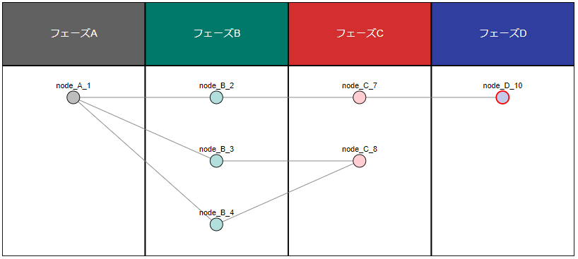

# Research Flow History

## Usage

### Drawing Research Flow History from Original Data (Research Flow History Original Data)

* Step 1. : Prepare original data for Research Flow History image.

    Prepare the original data(Research Flow History Original Data) of the Research Flow History you wish to draw. The data type of the source data must be a dictionary type.The code below is sample original data.

    See the [below section](#the-data-structure-of-the-research-flow-history-original-data) for the detailed data structure of the Research Flow History Original Data.


    ```python
    # Research Flow History Original Data
    sample_data = {
            'phase_data': [
                {
                    'seq_number' : 1,
                    'phase_name' : 'フェーズA',
                    'nodes' : [
                        {
                            'node_id' : 1,
                            'node_name' : 'node_A_1',
                            'status' : 'complete',
                            'link' : '',
                            'parent_ids' : [],
                            'start_time' : 1672498800
                        }
                    ]
                },
                {
                    'seq_number' : 2,
                    'phase_name' : 'フェーズB',
                    'nodes' : [
                        {
                            'node_id' : 2,
                            'node_name' : 'node_B_2',
                            'status' : 'complete',
                            'link' : '',
                            'parent_ids' : [1],
                            'start_time' : 1675177200
                        },
                        {
                            'node_id' : 3,
                            'node_name' : 'node_B_3',
                            'status' : 'complete',
                            'link' : '',
                            'parent_ids' : [1],
                            'start_time' : 1675263600
                        },
                        {
                            'node_id' : 4,
                            'node_name' : 'node_B_4',
                            'status' : 'complete',
                            'link' : '',
                            'parent_ids' : [1],
                            'start_time' : 1675350000
                        }
                    ]
                },
                {
                    'seq_number' : 3,
                    'phase_name' : 'フェーズC',
                    'nodes' : [
                        {
                            'node_id' : 7,
                            'node_name' : 'node_C_7',
                            'status' : 'complete',
                            'link' : '',
                            'parent_ids' : [2],
                            'start_time' : 1677596400
                        },
                        {
                            'node_id' : 8,
                            'node_name' : 'node_C_8',
                            'status' : 'complete',
                            'link' : '',
                            'parent_ids' : [3, 4],
                            'start_time' : 1677682800
                        },
                    ]
                },
                {
                    'seq_number' : 4,
                    'phase_name' : 'フェーズD',
                    'nodes' : [
                        {
                            'node_id' : 10,
                            'node_name' : 'node_D_10',
                            'status' : 'working',
                            'link' : 'http://sample.aaa.bbb',
                            'parent_ids' : [7],
                            'start_time' : 1677769200
                        }
                    ]
                },
            ]
        }
    ```

* Step 2. : Obtain a Research Flow History image from the original data.

    The original data is given to the FlowDrawer (dg_drawer.research_flow.flow_drawer) class to obtain a Research Flow History image. The resulting data is SVG data described by String type.

    ```python
    # Importing Modules
    from dg_drawer.research_flow.flow_drawer import FlowDrawer

    # Give the original data and get an FlowDrawer instance
    fd = FlowDrawer(raw_data=sample_data)

    # Draw a Research Flow History image(SVG)
    flow_history = fd.draw()
    ```

* Step 3. : Rendering Research Flow History SVG data

    Research Flow History renders from the resulting SVG data. (Rendering should be tailored to each situation)

    

### The Data Structure of the Research Flow History Original Data

(in development)